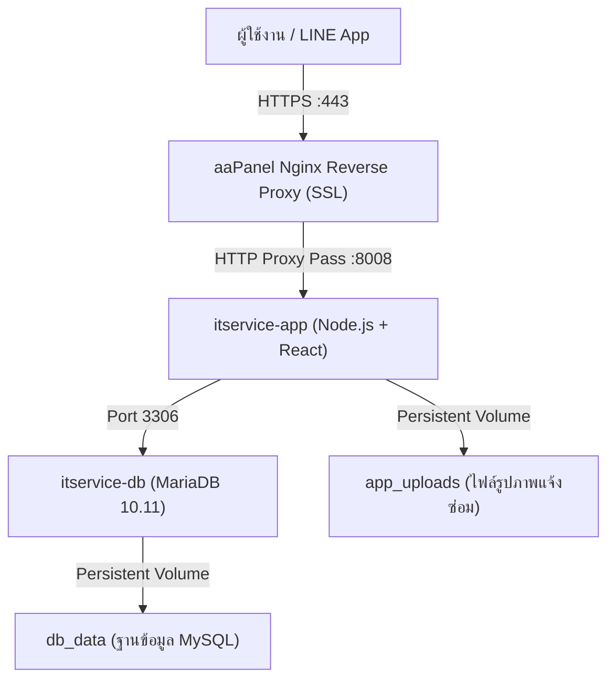

# คู่มือการนำระบบ Hospital IT Service Tracker ขึ้น Server (aaPanel + Docker)

เอกสารนี้แนะนำขั้นตอนการ Deploy ระบบ **Hospital IT Service Tracker** บน Server ที่ติดตั้งระบบจัดการ **aaPanel** โดยใช้ **Docker & Docker Compose**

---

## 🏗️ 1. สถาปัตยกรรมระบบใน Docker (Architecture)



---

## 🛠️ 2. สิ่งที่ต้องเตรียมบน aaPanel (Prerequisites)

1. เข้าหน้าเว็บคอนโซล **aaPanel**
2. ไปที่เมนู **App Store**:
   - ติดตั้ง **Nginx** (แนะนำ Nginx 1.22 หรือ 1.24)
   - ติดตั้ง **Docker Manager** (หากยังไม่มี ให้เปิด Terminal ใน aaPanel แล้วรัน `curl -fsSL https://get.docker.com | sh`)
3. มี Domain / Subdomain ชี้ A Record มายัง IP ของ Server (เช่น `itservice.hospital.go.th`)

---

## 📂 3. การนำโค้ดขึ้น Server (Source Code Setup)

เปิดเมนู **Terminal** ใน aaPanel หรือผ่าน SSH:

```bash
# 1. เข้าไปยังโฟลเดอร์เก็บเว็บไซต์ของ aaPanel
cd /www/wwwroot

# 2. Clone โค้ดจาก Git (หรืออัปโหลดไฟล์ zip ผ่านเมนู Files ของ aaPanel)
git clone https://github.com/tphcpgoth-ops/itservice-sla.git itservice

# 3. เข้าสู่โฟลเดอร์โปรเจกต์
cd /www/wwwroot/itservice
```

---

## ⚙️ 4. ตั้งค่า Environment Variables (`.env`)

คัดลอกไฟล์ตัวอย่างสำหรับ Docker:

```bash
cp .env.docker.example .env
```

จากนั้นแก้ไขไฟล์ `.env` (ผ่านคำสั่ง `nano .env` หรือดับเบิลคลิกแก้ในเมนู Files ของ aaPanel):

```ini
# Port ภายในเครื่อง
PORT=8008

# รหัสความปลอดภัย JWT (เปลี่ยนเป็นคีย์สุ่มยาวๆ)
JWT_SECRET=supersecretjwtkeyforhospitalitservice2026

# ตั้งค่าฐานข้อมูล (ใช้ service ชื่อ "db" ใน docker-compose)
DB_HOST=db
DB_USER=root
DB_PASSWORD=your_strong_hospital_db_password_2026
DB_NAME=itservice
DB_PORT=3306

# URL ของโดเมนจริง (ต้องเป็น HTTPS สำหรับ LINE OAuth)
FRONTEND_URL=https://itservice.tphcp.go.th

# ค่าคีย์จาก LINE Developers Console
LINE_LOGIN_CHANNEL_ID=1654103357
LINE_LOGIN_CHANNEL_SECRET=92c3120d5b7dd7f98d570dcd317df5a1
LINE_LOGIN_CALLBACK_URL=https://itservice.tphcp.go.th/api/auth/line/callback

LINE_MESSAGING_CHANNEL_ACCESS_TOKEN=your_messaging_channel_access_token_here
LINE_MESSAGING_CHANNEL_SECRET=19f1662a660fbce41a0e4557daff0efd

LINE_IT_GROUP_ID=C6c3b330050aac48e4851dea514734250
```

---

## 🚀 5. สั่ง Build และรัน Docker Containers

รันคำสั่ง Docker Compose ในโฟลเดอร์ `/www/wwwroot/itservice`:

```bash
# สั่ง Build และรันในโหมด Background Daemon
docker compose up -d --build
```

### การตรวจสอบสถานะ:
```bash
# ตรวจสอบสถานะตู้คอนเทนเนอร์ (ต้องขึ้น running / healthy)
docker compose ps

# ดูบันทึกการทำงานแบบ Real-time
docker compose logs -f app
```

*(ฐานข้อมูล MariaDB จะรันไฟล์ `backend/schema.sql` อัตโนมัติในครั้งแรกเพื่อสร้างตารางและข้อมูลตั้งต้น)*

---

## 🌐 6. ตั้งค่า Domain, SSL และ Reverse Proxy บน aaPanel

เนื่องจากระบบรันอยู่ภายใน Docker ที่พอร์ต `8008` เราจะใช้ Nginx ของ aaPanel เป็นตัวรับ Request จากภายนอกและทำ SSL:

### ขั้นตอนที่ 6.1: สร้าง Website บน aaPanel
1. ไปที่เมนู **Website** -> กด **Add Site**
2. ใส่ Domain name: `itservice.tphcp.go.th`
3. Database: เลือก **No** (เพราะเราใช้ฐานข้อมูลใน Docker แล้ว)
4. กด **Submit**

### ขั้นตอนที่ 6.2: ติดตั้ง SSL Certificate (HTTPS)
1. คลิกที่ชื่อโดเมนที่สร้างไว้ -> ไปที่แท็บ **SSL**
2. เลือก **Let's Encrypt** -> ติ๊กเลือกชื่อโดเมน
3. กด **Apply** เพื่อขอ Certificate ฟรี
4. เปิดสวิตช์ **Force HTTPS** เพื่อบังคับใช้งานผ่าน HTTPS

### ขั้นตอนที่ 6.3: ตั้งค่า Reverse Proxy ไปยัง Docker
1. ในหน้าตั้งค่า Website เดียวกัน ไปที่แท็บ **Reverse Proxy** -> กด **Add Reverse Proxy**
2. กรอกข้อมูลดังนี้:
   - **Proxy Name:** `itservice-docker`
   - **Target URL:** `http://127.0.0.1:8008`
   - **Sent Domain:** `$host`
3. กด **Submit**

> 🎉 ตอนนี้คุณสามารถเข้าใช้งานระบบผ่าน `https://itservice.tphcp.go.th` ได้เรียบร้อยแล้ว!

---

## 💬 7. อัปเดต LINE Developers Console

เพื่อให้ระบบ LINE Login และ Messaging API ทำงานบนโดเมนจริง:

1. เข้าไปที่ [LINE Developers Console](https://developers.line.biz/)
2. เลือก Provider และ Channel ของคุณ:
   - **LINE Login Channel:**
     - ไปที่แท็บ **LINE Login**
     - ในช่อง **Callback URL** ให้เพิ่ม:
       `https://itservice.hospital.go.th/api/auth/line/callback`
   - **Messaging API Channel:**
     - ไปที่แท็บ **Messaging API**
     - ในช่อง **Webhook URL** ให้ใส่:
       `https://itservice.hospital.go.th/api/line/webhook`
     - เปิดสวิตช์ **Use Webhook** เป็น **Enabled**

---

## 🔄 8. วิธีการอัปเดตเวอร์ชันใหม่ในอนาคต (Updating Code)

เมื่อมีการแก้ไขหรือ Commit โค้ดใหม่:

```bash
cd /www/wwwroot/itservice
git pull
docker compose up -d --build
```
ระบบจะทำการ Rebuild Frontend & Backend ใหม่อัตโนมัติ โดยที่ข้อมูลในฐานข้อมูล (`db_data`) และรูปภาพที่ผู้ใช้เคยอัปโหลด (`app_uploads`) จะยังคงอยู่ครบถ้วน 100%

---

## 💾 9. การสำรองข้อมูล (Backup)

- **ฐานข้อมูล:** สามารถ Dump ออกมาได้ผ่านคำสั่ง:
  ```bash
  docker compose exec db mariadb-dump -u root -p itservice > backup_$(date +%F).sql
  ```
- **ไฟล์รูปภาพ:** รูปที่แนบทั้งหมดถูกเก็บไว้ใน Docker volume `itservice_app_uploads`
